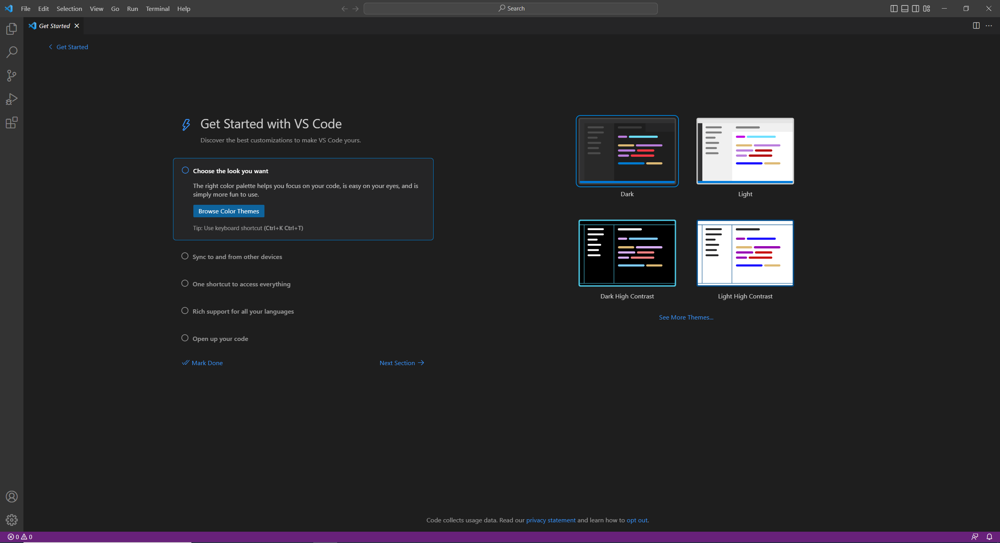
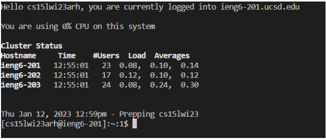
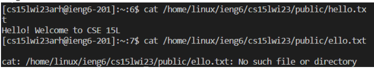

# Jan12LabReport
To install VS Code (I personally had it preinstalled on the lab computer, but have my own VSC at home), visit the website  https://code.visualstudio.com/ and do
as instructed to eventually have VS Code in your computer.

Once you have Visual Studio Code, you can use the terminal to connect remotely to where you desire; for us, we connected using gitbash, which you can install at
https://gitforwindows.org/ . Once done with this, open the terminal in VSC with Ctrl+` and you type into it the following:

`$ssh cs15lwi23zz@ieng6.ucsd.edu`. 
(For us our account was more specific, removing the zz for another of an apprently random 3-letter permutation).
You put your password in, which may be made difficult by the fact you can't see what inputs are being received visually, and you get the following:

From here you can perform commands. I tried concatenating the Hello.txt file from within the computer I connected to, got the following alongside an error below it
since I was encouraged to see if I could make an error occur, which for a professional on those was easy.

And all that was done in lab is completed, aside from the setup of the page where this is in itself. 

Thanks for reading and good evening.
