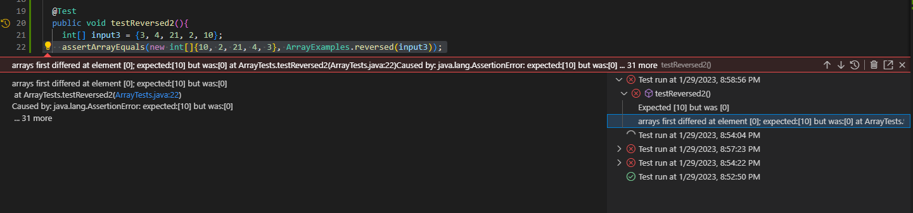

My code for the StringServer assignment is:

import java.io.IOException;
import java.net.URI;

  class Handler implements URLHandler {
      protected int DEFAULT_LENGTH = 100;
      String[] words = new String[DEFAULT_LENGTH];
      int size = 0;
      String wordList = "";

      public String handleRequest(URI url) {
          if (url.getPath().equals("/")) {
              String con = "Current strings: \n";

              if(size != 0){
                  for(int i = 0; i < size; i++){
                      con += words[i] + "\n";
                  }
              }

              return con;
          } else if(url.getPath().equals("/add-message")){
              String[] parameters = url.getQuery().split("=");
              if(parameters[0].equals("s")){
                  size++;
                  words[size-1] = parameters[1];
                  wordList += parameters[1] + "\n";
                  return "String added; now strings are:\n" +  wordList;
              }

          }
          return String.format("404 Nothing Found :[");
          }
      }

  class StringServer {
      public static void main(String[] args) throws IOException {
          if(args.length == 0){
              System.out.println("Missing port number! Try any number between 1024 to 49151");
              return;
          }

          int port = Integer.parseInt(args[0]);

          Server.start(port, new Handler());
      }
  } 

Now, this is pretty hefty, but most of these lines are repurposing of what we used for the NumberServer and SearchEngine, mostly because I am yet to
still understand what the Server.java file we received does. This program simply adds strings to an array of strings when you type

'http://localhost:####/add-message?s=<string>' 

where the port number is a number between 1024 and 49151 as seen in the error printout. 

Here are two instances of using the code for port 8080 in my local server:

The handleRequest method is called whenever a change to the URL is made, inputting it into the URL parameter, and dissecting it to see if 
the server is asked to add a string appended at the end of the query. I created an array of words to use here, to be completely honest it's
a vestiege of my code for SearchEngine, but I used it to create the print out when there is no path, so it got some use. Alternatively to store all the strings
in a presentable manner onto the server, I created an empty string, and then I append to this the words or phrases that are added. The size parameter
keeps track of how  many strings we have thus far every time we get a succesful path and query pair of add-message?s=. If everything fails, we get an error for
an undefined path.

####Lab 3

For lab 3 we did some testing and debugging work, and as an example we have the ArrayExamples and ArrayTests. (I apparently had no time during lab to commit
changes onto the repository for the last part, luckily I did do it for the first example, also I had to clone the original repository to get the faulty
code).

The JUnit test I wrote that failed was:
    @Test 
    public void testReversed2(){
      int[] input3 = {3, 4, 21, 2, 10};
      assertArrayEquals(new int[]{10, 2, 21, 4, 3}, ArrayExamples.reversed(input3));
    }
  
The error being that we expected 10 to be the first value in the array, but it was sadly 0. Here's a screenshot of that error:

The original tester came with code that did work for the Reversed method it being below:
    @Test
    public void testReversed() {
      int[] input1 = { };
      assertArrayEquals(new int[]{ }, ArrayExamples.reversed(input1));
    }

So an empty array has nothing to reverse, and seems to work fine. This test doesn't really have an output, but it does have a 
green checkmark next to it in VSCode:

Now the faulty code was:
    static int[] reversed(int[] arr) {
      int[] newArray = new int[arr.length];
      for(int i = 0; i < arr.length; i += 1) {
        arr[i] = newArray[arr.length - i - 1];
      }
      return arr;
    }
  
As can be seen the newArray that this method it's meant to return (mentioned in comments above the method not shown here), is not actually returned.
Instead, we assign all the values of the freshly initialized newArray to the inputted arr, and return arr, which is now filled with nulls/0.

The fix was simple:
    static int[] reversed(int[] arr) {
      int[] newArray = new int[arr.length];
      for(int i = 0; i < arr.length; i += 1) {
        newArray[i] = arr[arr.length - i - 1];
      }
      return newArray;
    }
  
Just make sure that the values of arr are assigned properly to the newArray in reverse order and return the newArray variable. Really fun
thinking experiment, testing and debugging is.

####Conclusion
In these 2 weeks of labs I found the most interesting out work on the local servers, and the better understanding I have of the URL formats I see daily; I've
tried to memorize the query for the Never Gonna Give You Up song by Rick Astley, but I still got RickRolled. I liked how the code I worked on in VSCode had an effect
on my browser. The idea of working with servers is infinitely interesting, but to me it is such a daunting topic I know very little about, I wish to
change that, and maybe create some web apps for fun some day. I rate week 2 and 3 positively. 

