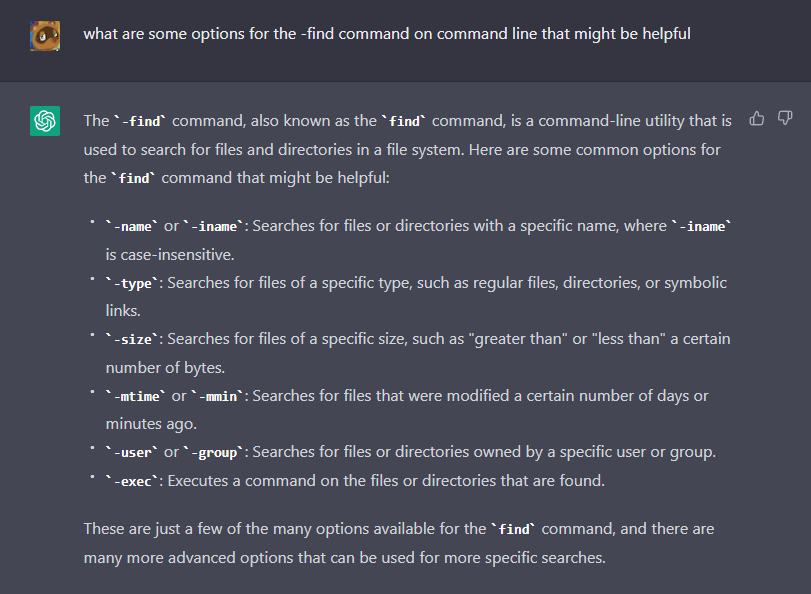
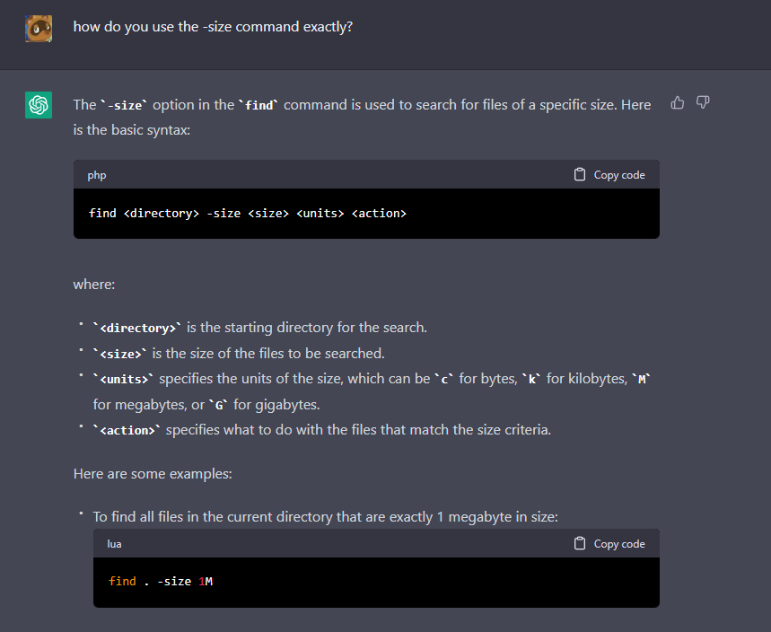
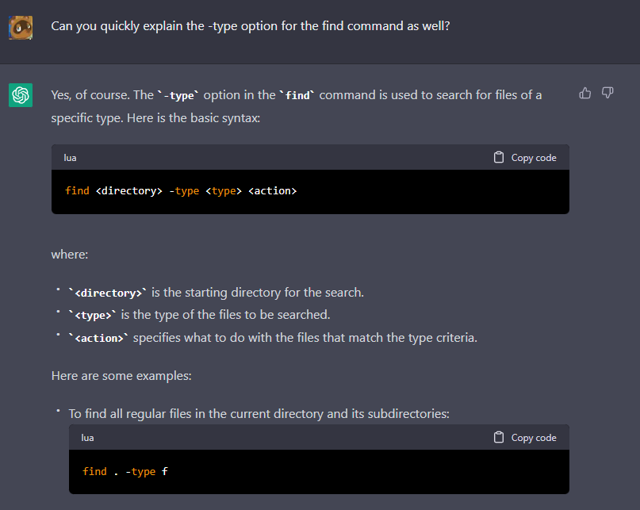

For the lab we did a few weeks ago we worked and played (in the serious sense) around with some commands
that are useful to facilitate finding files and infomation on directories and files themselves. Here I will
explore some of the options available for the `find` command.

First comes the -maxdepth option:

1.

        $ find written_2 -maxdepth 2
        written_2
        written_2/non-fiction
        written_2/non-fiction/OUP
        written_2/travel_guides
        written_2/travel_guides/berlitz1
        written_2/travel_guides/berlitz2
2.

        $ find written_2 -maxdepth 1
        written_2
        written_2/non-fiction
        written_2/travel_guides
        
This option makes the command search within the given directory up to a certain number of paths (/).
As can be seen above, when we have maxdepth 2, we can go down into what's 2 layers deep within the
written_2 subfolders, while with one we only get the immediate subfolders; only 1 slash.

Similarly we hace the -mindepth command option:

1.

        $ find written_2 -mindepth 4
        written_2/non-fiction/OUP/Abernathy/ch1.txt
        written_2/non-fiction/OUP/Abernathy/ch14.txt
        written_2/non-fiction/OUP/Abernathy/ch15.txt
        written_2/non-fiction/OUP/Abernathy/ch2.txt
        written_2/non-fiction/OUP/Abernathy/ch3.txt
        written_2/non-fiction/OUP/Abernathy/ch6.txt
        written_2/non-fiction/OUP/Abernathy/ch7.txt
        written_2/non-fiction/OUP/Abernathy/ch8.txt
        written_2/non-fiction/OUP/Abernathy/ch9.txt
        written_2/non-fiction/OUP/Berk/ch1.txt
        written_2/non-fiction/OUP/Berk/ch2.txt
        written_2/non-fiction/OUP/Berk/CH4.txt
        written_2/non-fiction/OUP/Berk/ch7.txt
        written_2/non-fiction/OUP/Castro/chA.txt
        written_2/non-fiction/OUP/Castro/chB.txt
        written_2/non-fiction/OUP/Castro/chC.txt
        written_2/non-fiction/OUP/Castro/chL.txt
        written_2/non-fiction/OUP/Castro/chM.txt
        written_2/non-fiction/OUP/Castro/chN.txt
        written_2/non-fiction/OUP/Castro/chO.txt
        written_2/non-fiction/OUP/Castro/chP.txt
        written_2/non-fiction/OUP/Castro/chQ.txt
        written_2/non-fiction/OUP/Castro/chR.txt
        written_2/non-fiction/OUP/Castro/chV.txt
        written_2/non-fiction/OUP/Castro/chW.txt
        written_2/non-fiction/OUP/Castro/chY.txt
        written_2/non-fiction/OUP/Castro/chZ.txt
        written_2/non-fiction/OUP/Fletcher/ch1.txt
        written_2/non-fiction/OUP/Fletcher/ch10.txt
        written_2/non-fiction/OUP/Fletcher/ch2.txt
        written_2/non-fiction/OUP/Fletcher/ch5.txt
        written_2/non-fiction/OUP/Fletcher/ch6.txt
        written_2/non-fiction/OUP/Fletcher/ch9.txt
        written_2/non-fiction/OUP/Kauffman/ch1.txt
        written_2/non-fiction/OUP/Kauffman/ch10.txt
        written_2/non-fiction/OUP/Kauffman/ch3.txt
        written_2/non-fiction/OUP/Kauffman/ch4.txt
        written_2/non-fiction/OUP/Kauffman/ch5.txt
        written_2/non-fiction/OUP/Kauffman/ch6.txt
        written_2/non-fiction/OUP/Kauffman/ch7.txt
        written_2/non-fiction/OUP/Kauffman/ch8.txt
        written_2/non-fiction/OUP/Kauffman/ch9.txt
        written_2/non-fiction/OUP/Rybczynski/ch1.txt
        written_2/non-fiction/OUP/Rybczynski/ch2.txt
        written_2/non-fiction/OUP/Rybczynski/ch3.txt

2.

        $ find written_2 -mindepth 1
        written_2/non-fiction
        written_2/non-fiction/OUP
        written_2/non-fiction/OUP/Abernathy
        written_2/non-fiction/OUP/Abernathy/ch1.txt
        written_2/non-fiction/OUP/Abernathy/ch14.txt
        written_2/non-fiction/OUP/Abernathy/ch15.txt
        written_2/non-fiction/OUP/Abernathy/ch2.txt
        written_2/non-fiction/OUP/Abernathy/ch3.txt
        written_2/non-fiction/OUP/Abernathy/ch6.txt
        written_2/non-fiction/OUP/Abernathy/ch7.txt
        written_2/non-fiction/OUP/Abernathy/ch8.txt
        written_2/non-fiction/OUP/Abernathy/ch9.txt
        written_2/non-fiction/OUP/Berk
        written_2/non-fiction/OUP/Berk/ch1.txt
        written_2/non-fiction/OUP/Berk/ch2.txt
        written_2/non-fiction/OUP/Berk/CH4.txt
        written_2/non-fiction/OUP/Berk/ch7.txt
        written_2/non-fiction/OUP/Castro
        written_2/non-fiction/OUP/Castro/chA.txt
        written_2/non-fiction/OUP/Castro/chB.txt
        written_2/non-fiction/OUP/Castro/chC.txt
        written_2/non-fiction/OUP/Castro/chL.txt
        written_2/non-fiction/OUP/Castro/chM.txt
        written_2/non-fiction/OUP/Castro/chN.txt
        written_2/non-fiction/OUP/Castro/chO.txt
        written_2/non-fiction/OUP/Castro/chP.txt
        written_2/non-fiction/OUP/Castro/chQ.txt
        written_2/non-fiction/OUP/Castro/chR.txt
        written_2/non-fiction/OUP/Castro/chV.txt
        written_2/non-fiction/OUP/Castro/chW.txt
        written_2/non-fiction/OUP/Castro/chY.txt
        written_2/non-fiction/OUP/Castro/chZ.txt
        written_2/non-fiction/OUP/Fletcher
        written_2/non-fiction/OUP/Fletcher/ch1.txt
        written_2/non-fiction/OUP/Fletcher/ch10.txt
        written_2/non-fiction/OUP/Fletcher/ch2.txt
        written_2/non-fiction/OUP/Fletcher/ch5.txt
        written_2/non-fiction/OUP/Fletcher/ch6.txt
        written_2/non-fiction/OUP/Fletcher/ch9.txt
        written_2/non-fiction/OUP/Kauffman
        written_2/non-fiction/OUP/Kauffman/ch1.txt
        written_2/non-fiction/OUP/Kauffman/ch10.txt
        written_2/non-fiction/OUP/Kauffman/ch3.txt
        written_2/non-fiction/OUP/Kauffman/ch4.txt
        written_2/non-fiction/OUP/Kauffman/ch5.txt
        written_2/non-fiction/OUP/Kauffman/ch6.txt
        written_2/non-fiction/OUP/Kauffman/ch7.txt
        written_2/non-fiction/OUP/Kauffman/ch8.txt
        written_2/non-fiction/OUP/Kauffman/ch9.txt
        written_2/non-fiction/OUP/Rybczynski
        written_2/non-fiction/OUP/Rybczynski/ch1.txt
        written_2/non-fiction/OUP/Rybczynski/ch2.txt
        written_2/non-fiction/OUP/Rybczynski/ch3.txt
        written_2/travel_guides
        written_2/travel_guides/berlitz1
        written_2/travel_guides/berlitz1/HandRHawaii.txt
        written_2/travel_guides/berlitz1/HandRHongKong.txt
        ...

As can be seen this one defines what the minimum amount of depth we are traversing is, accounted by the number of slashes.
The second one may seem normal, but it skips the 'written_2' directory print-out, as can quickly be seen—

        $ find written_2
        written_2
        written_2/non-fiction
        written_2/non-fiction/OUP
        written_2/non-fiction/OUP/Abernathy
        written_2/non-fiction/OUP/Abernathy/ch1.txt
        written_2/non-fiction/OUP/Abernathy/ch14.txt
        written_2/non-fiction/OUP/Abernathy/ch15.txt
        written_2/non-fiction/OUP/Abernathy/ch2.txt
        ...

These two commands can be used individually or in conjunction to parse out what files are found at certain sub-levels of
the current directory, which is helpful to pinpoint exactly what we may be working with, or even how deep it goes.

In the website I used to find many of the commands ([website here](https://linux.die.net/man/1/find)) I tried using the size command
not knowing that the default was finding files that were exactly matching the size I inputted. Thankfully ChatGPT helped me out, here's a snippet
of the conversation that inspired the following examples on written_2:

With this info I was able to find:

1.

        $ find  written_2 -size +200b
        written_2/non-fiction/OUP/Berk/ch2.txt
        written_2/non-fiction/OUP/Berk/CH4.txt
        written_2/travel_guides/berlitz1/WhereToFrance.txt
        written_2/travel_guides/berlitz1/WhereToIndia.txt
        written_2/travel_guides/berlitz1/WhereToItaly.txt
        written_2/travel_guides/berlitz1/WhereToJapan.txt
        written_2/travel_guides/berlitz1/WhereToMalaysia.txt
        written_2/travel_guides/berlitz2/Canada-WhereToGo.txt
        written_2/travel_guides/berlitz2/China-WhereToGo.txt
        written_2/travel_guides/berlitz2/Portugal-WhereToGo.txt

2.

        $ find  written_2 -size +500b
        written_2/travel_guides/berlitz1/WhereToFrance.txt
        written_2/travel_guides/berlitz1/WhereToItaly.txt

With this tool you may be able to quickly find what a particular file weighs, or to find a file(s) you might
not know may be taking loads of memory, and as ChatGPT showed, also delete them in the same command.

Finally I queried one last time to ChatGPT for help with the -type option:

Using that lead we can confirm that in fact:

1.

        $ find  written_2 -type f
        written_2/non-fiction/OUP/Abernathy/ch1.txt
        written_2/non-fiction/OUP/Abernathy/ch14.txt
        written_2/non-fiction/OUP/Abernathy/ch15.txt
        written_2/non-fiction/OUP/Abernathy/ch2.txt
        written_2/non-fiction/OUP/Abernathy/ch3.txt
        written_2/non-fiction/OUP/Abernathy/ch6.txt
        written_2/non-fiction/OUP/Abernathy/ch7.txt
        written_2/non-fiction/OUP/Abernathy/ch8.txt
        written_2/non-fiction/OUP/Abernathy/ch9.txt
        written_2/non-fiction/OUP/Berk/ch1.txt
        written_2/non-fiction/OUP/Berk/ch2.txt
        written_2/non-fiction/OUP/Berk/CH4.txt
        written_2/non-fiction/OUP/Berk/ch7.txt
        written_2/non-fiction/OUP/Castro/chA.txt
        written_2/non-fiction/OUP/Castro/chB.txt
        written_2/non-fiction/OUP/Castro/chC.txt
        written_2/non-fiction/OUP/Castro/chL.txt
        written_2/non-fiction/OUP/Castro/chM.txt
        written_2/non-fiction/OUP/Castro/chN.txt
        written_2/non-fiction/OUP/Castro/chO.txt
        written_2/non-fiction/OUP/Castro/chP.txt
        written_2/non-fiction/OUP/Castro/chQ.txt
        ...

2.

        $ find  written_2 -type d
        written_2
        written_2/non-fiction
        written_2/non-fiction/OUP
        written_2/non-fiction/OUP/Abernathy
        written_2/non-fiction/OUP/Berk
        written_2/non-fiction/OUP/Castro
        written_2/non-fiction/OUP/Fletcher
        written_2/non-fiction/OUP/Kauffman
        written_2/non-fiction/OUP/Rybczynski
        written_2/travel_guides
        written_2/travel_guides/berlitz1
        written_2/travel_guides/berlitz2

The usefulness is pretty clear, you can remove the usual clutter of normal find that prints
out an amalgamation of directories and files and extract exactly what you wish to see. You
may even combine it with the `-name` option to find a directory you specifically want to see.

        $ find  written_2 -type d -name "*berlitz*"
        written_2/travel_guides/berlitz1
        written_2/travel_guides/berlitz2

Finally to end this, I had some casual chat with ChatGPT that I think I can add at the end here.

