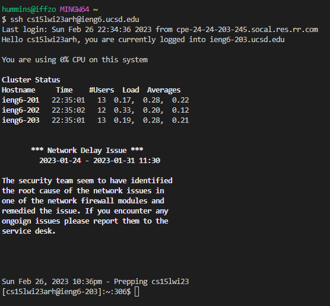
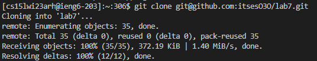
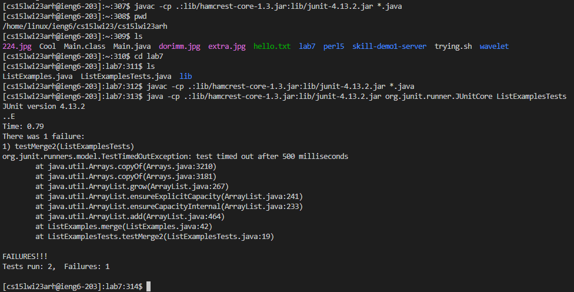
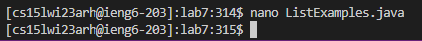
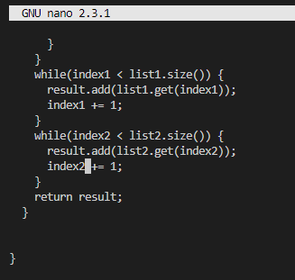
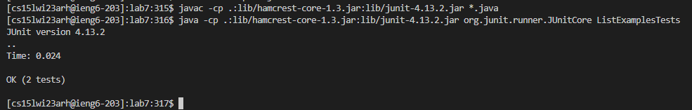
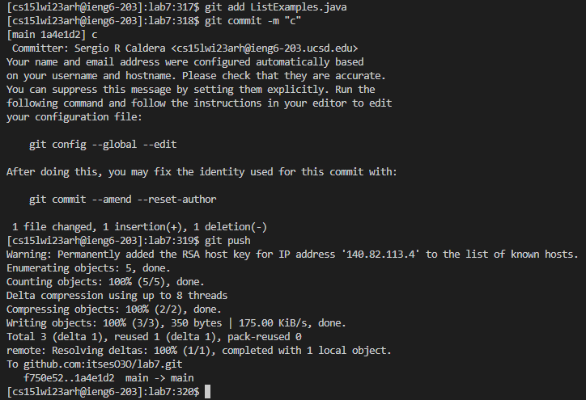

I started writing the exact steps at around step 4, so some of the ones before are from memory guesses so I don't have to re-set up everything to
count the number of times I did up arrow. So starting from step 1:

## 1st

>`<Up><Enter>`

I had already accessed the server while setting up, so I just had to do a small seek of my history by up arrow and entering the previously
entered command.

## 2nd

>`git clone <Ctrl+v>`

I had the ssh link to the github fork (`git@github.com:itsesO3O/lab7.git`) on my clipboard, so I easily added it and kept on to
the next steps.

## 3rd

>`cd lab7`

>`<Up>(~x12)<Enter>`

>`<Up>(~x21)<Enter>`

I had `javac -cp .:lib/hamcrest-core-1.3.jar:lib/junit-4.13.2.jar *.java` and 
`java -cp .:lib/hamcrest-core-1.3.jar:lib/junit-4.13.2.jar org.junit.runner.JUnitCore ListExamplesTests`
right next to each other in my machine history, but I forgot to change into lab7 the first time I ran `javac`, so the amount of times I had to
go up changed; I tried imagining I'd done the `cd lab7` before all the other commands, but my memory of the exact count is tired.

## 4th

>`nano ListExamples.java`

>`<Down>(held)<Up><Up><Up><Up><Up><Up><Up><Right><Right><Right><Right><Right><Right><Right><Right><Right><Right><Right><Right><Backspace><2>`

>`<Ctrl-o><enter><Ctrl-x>`

I typed in the whole thing for `nano ListExamples.java` and once in I held down the down arrow until I hit the file's bottom, then I performed the
second line of commands to get to the error location and change `index1` to `index2`. Saved with the `Ctrl-o` and `enter` and exited with `Ctrl-x`.

## 5th

>`<Up><Up><Enter>` and `<Up><Up><Up><Enter>`

This time the test compile and run commands where in a much nearer location in my history.

## 6th

>`git add Lis<Tab>.java`

>`git commit -m "c"`

>`git push`

While typing the add command (at first I almost commited before adding, but that's unreported here), I remembered the Tab trick and used it, but
it did not autofill the `.java` ending, so I manually typed it in. I commited with "c" as the message, because indeed c. I was able to push it with the simple
`git push` command without adding anything else thanks to using the ssh link at the beginning.

With these techniques you can get safe sub-hour times.
